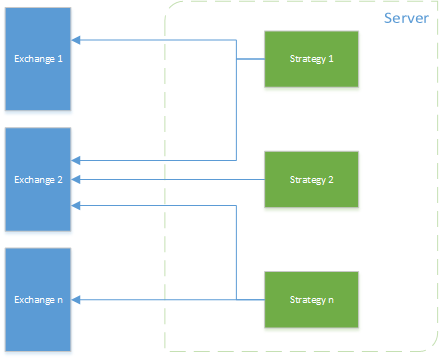

# Market Center

A center to collect market data from cryptocurrency exchanges and distribute it over UDS(Unix Domain Sockets) using [GoEx](https://github.com/nntaoli-project/GoEx), it design for multi-strategy in one server, especial hft(high frequency trading) 

## NOT Support Windows

## Why market center
Some exchanges has limitation for **REST** api, limit access frequency by IP or Account.

Usually we start some strategies in one server(description followed), Exchange 2 maybe ban your server IP because too many request.

So we could use a market center as a router to avoid limitation(description followed)

## APIs

Ref to [Client](https://github.com/goex-top/market_center_client)

params
- exchangeName: exchange name, ref to [Supports](#support-exchanges)
- currencyPair: currency pair, format with `_`, like `BTC_USDT`
- period: market data update period, unit ms
- contractType: future/swap contract type

* GetSupportList() []
* SubscribeSpotTicker(exchangeName, currencyPair, period) (error)
* SubscribeSpotDepth(exchangeName, currencyPair, period) (error)
* ~~SubscribeSpotTrade(exchangeName, currencyPair) (error)~~
* GetSpotTicker(exchangeName, currencyPair) (*Ticker, error)
* GetSpotDepth(exchangeName, currencyPair) (*Depth, error)
* ~~GetSpotTrade(exchangeName, currencyPair) (*Trade, error)~~
* SubscribeFutureTicker(exchangeName, contractType, currencyPair, period) (error)
* SubscribeFutureDepth(exchangeName, contractType, currencyPair, period) (error)
* ~~SubscribeFutureTrade(exchangeName, contractType, currencyPair) (error)~~
* GetFutureTicker(exchangeName, contractType, currencyPair) (*Ticker, error)
* GetFutureDepth(exchangeName, contractType, currencyPair) (*Depth, error)
* ~~GetFutureTrade(exchangeName, contractType, currencyPair) (*Trade, error)~~

## Support Exchanges
### SPOT
* poloniex.com
* bitstamp.net
* huobi.pro
* bitfinex.com
* okex.com_v3
* binance.com
* bittrex.com
* bithumb.com
* gdax.com
* gate.io
* coinex.com
* zb.com
* fcoin.com
* fcoin.com_margin
* big.one
* hitbtc.com

### FUTURE
* bitmex.com
* okex.com_future
* okex.com_swap
* hbdm.com
* coinbene.com
* fmex.com

## Proxy

center will get proxy setting from system environment, key word is `HTTP_PROXY`. if you want to use proxy for center, `set HTTP_PROXY=socks5://127.0.0.1:1080` or `export HTTP_PROXY=socks5://127.0.0.1:1080`
 
## Client

golang client 
[https://github.com/goex-top/market_center_client](https://github.com/goex-top/market_center_client)

fmz js client
[https://github.com/goex-top/market_center_client_fmz](https://github.com/goex-top/market_center_client_fmz)

## Why UDS
### benchmark compare between USD and TCP/IP loopback

* When the server and client benchmark programs run on the same box, both the TCP/IP loopback and unix domain sockets can be used. Depending on the platform, unix domain sockets can achieve around 50% more throughput than the TCP/IP loopback (on Linux for instance). The default behavior of redis-benchmark is to use the TCP/IP loopback.[redis report](https://redis.io/topics/benchmarks)
* [Performance Analysis of Various Mechanisms
for Inter-process Communication
](http://osnet.cs.binghamton.edu/publications/TR-20070820.pdf)

## How UDS
* [unix-domain-sockets-in-go](https://eli.thegreenplace.net/2019/unix-domain-sockets-in-go/)

### 观星者

